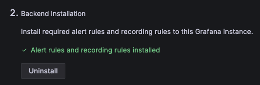
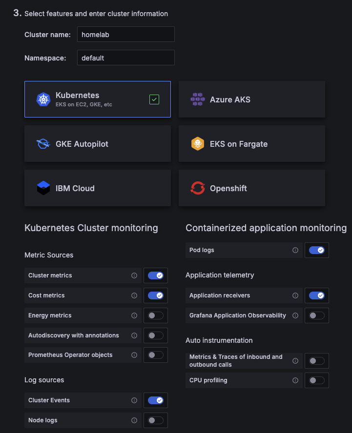

# Kubernetes monitoring

## Usage

1. Install on your machine prerequisites:
   1. `kubectl`
   2. `helm`
2. In `grafana.net` go to `Home -> Infrastructure -> Kubernetes -> Configuration`
3. Do steps for backend installation in order to install required alert rules and recording rules to this Grafana instance.

4. Enter name of the cluster and namespace and select required features for Kubernetes cluster monitoring and application monitoring.

5. Create Grafan token and put it's value into `.env` file by command:
```bash
echo "export GRAFANA_CLOUD_API_KEY='...'" > .env
```
6. Deploy monitoring resources by command:
```bash
task grafana-deploy
```
7. Explore cluster status in `Home -> Infrastructure -> Kubernetes -> Clusters`

## Links

- [Grafana Cloud - Setup Guide](https://sebastianczech.grafana.net/a/cloud-home-app/setup-guide)
- [Grafana Cloud - Configuration for Kubernetes](https://sebastianczech.grafana.net/a/grafana-k8s-app/configuration)
- [Documentation - Configure Kubernetes Monitoring](https://grafana.com/docs/grafana-cloud/monitor-infrastructure/kubernetes-monitoring/configuration/)
- [Overview of Grafana Kubernetes Monitoring Helm chart](https://grafana.com/docs/grafana-cloud/monitor-infrastructure/kubernetes-monitoring/configuration/helm-chart-config/helm-chart/)
- [Configure Kubernetes Monitoring with other methods](https://grafana.com/docs/grafana-cloud/monitor-infrastructure/kubernetes-monitoring/configuration/config-other-methods/)
- [Helm provider](https://registry.terraform.io/providers/hashicorp/helm/latest/docs)
- [k8s-monitoring](https://github.com/grafana/k8s-monitoring-helm/tree/main/charts/k8s-monitoring)
- [Introduction to Fleet Management](https://grafana.com/docs/grafana-cloud/send-data/fleet-management/introduction/)